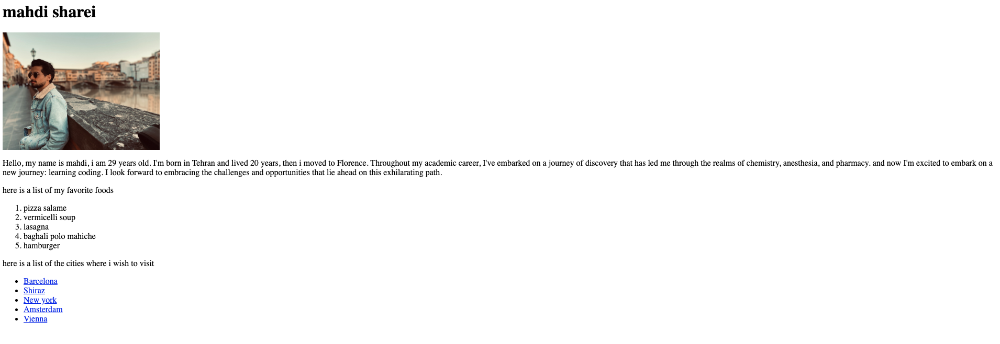

# ex00 – Personal HTML Page

A simple **HTML page** about myself, created as the first exercise of my frontend bootcamp.

## Preview

  

Demo: [GitHub Pages Link](https://mahdisharei.github.io/frontend-bootcamp-exercises/ex00/)  

## Features
- Title and heading with my name  
- Personal introduction paragraph  
- An image of myself  
- Ordered list of my favorite foods  
- Unordered list of cities I want to visit (with links to Wikipedia)

## Tech
- Pure HTML5 (no CSS/JS yet)

## How to Run
Open the `index.html` file directly in any web browser:

```bash
cd ex00
open index.html   # (Mac)
xdg-open index.html   # (Linux)
start index.html  # (Windows)